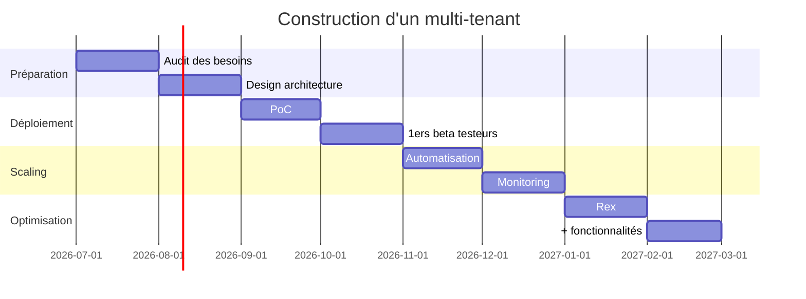

## :lucide-shield-question-mark: Qu'est-ce que le multi-tenant et quels sont ses défis ?

Dans les grandes organisations, rationaliser les services socles est une réponse
fréquente au besoin de réduire les coûts et de faire converger les usages.
Sur un service partagé, plusieurs équipes utilisent la même plateforme, mais
elles doivent conserver une isolation suffisante pour ne pas se nuire mutuellement.

La tendance apparaît souvent au-delà de 100 développeurs : un service externe est
mutualisé, un responsable dédié est nommé, et les équipes ne veulent plus porter
la charge opérationnelle d'un outil qu'elles consomment.

### :lucide-book-text: Définition

Le multi-tenant est un modèle d'architecture où une seule instance d'un service
est partagée par plusieurs tenants (équipes, projets, périmètres) tout en
conservant une isolation suffisante entre eux.
Son intérêt est de réduire les coûts d'exploitation et de maintenance, tout en
offrant une expertise centralisée.

| Service | Problème mono-tenant | Bénéfice multi-tenant |
| --- | --- | --- |
| Jenkins | Chaque équipe gère son propre serveur → gaspillage CPU et maintenance | Queue partagée avec quotas et isolation des travaux |
| SonarQube | Duplication des règles de qualité | Configuration centrale avec profils personnalisés |
| Nexus/Artifactory | Stockage redondant des artefacts | Espace mutualisé avec isolation des dépôts |
| Vault | Instances dispersées, politiques hétérogènes | Politique unifiée, audit et rotation centralisés |
| Keycloak | Multiples instances, complexité SSO | Authentification centralisée et gestion des realms |

### :lucide-activity: Défis

Le multi-tenant simplifie l’accès des consommateurs, mais il déplace la complexité
vers l’équipe de plateforme.

Par exemple, sur un Jenkins partagé :

- une équipe peut saturer la file d'attente et allonger les temps d'attente pour les autres ;
- une modification d'environnement d'un tenant peut provoquer une régression chez un autre.

Lors d’une mise à jour ou d’une montée de version, l’impact se mesure simultanément
sur toutes les équipes. Il faut donc renforcer la surveillance, la validation et les
mécanismes de rollback pour limiter les risques.

Le choix entre un projet *brownfield* ou *greenfield* influence la satisfaction des
utilisateurs : on ne peut pas retirer plus de fonctionnalité que ce que le service
apporte en valeur.

## :lucide-search-check: Comparaison des modèles opérationnels

Le multi-tenant n’est pas la solution automatique. Selon le contexte, il peut coexister
avec des modèles mono-tenant ou SaaS.

| Critère | Mono-tenant | Multi-tenant | SaaS |
| --- | --- | --- | --- |
| Coût initial | ❌ Élevé (installation par équipe) | ✅ Faible (1 instance mutualisée) | ⚠️ Variable (abonnements) |
| Maintenance | ❌ Dispersée | ✅ Centralisée | ✅ Gérée par le fournisseur |
| Expertise requise | ❌ par équipe | ✅ 1 équipe dédiée | ⚠️ externe |
| Flexibilité | ✅ Maximale | ⚠️ Limitée mais configurable | ⚠️ Dépend du fournisseur |
| Isolation | ✅ Totale | ⚠️ À concevoir (logique/physique) | ⚠️ Dépend du fournisseur |
| Sécurité | ✅ Contrôle total | ✅ Centralisée (mais risque partagé) | ⚠️ Dépend du fournisseur |
| Compatible Air-gap | ✅ Possible | ✅ Possible | ❌ Difficile |
| Time-to-market | ❌ Lent | ✅ Rapide | ✅ Immédiat |

Le mono-tenant conserve une autonomie maximale, mais il coûte plus cher et multiplie
la maintenance. Le SaaS réduit la charge interne, mais renonce au contrôle et à la
déportation de certaines contraintes. Le multi-tenant est un compromis valable lorsque
l’on peut standardiser suffisamment les usages et investir dans une équipe de support.

## :lucide-unplug: Définir les capacités du service

Avant de lancer un produit multi-tenant, définissez clairement les capacités attendues :

1. **Isolation** : séparer les données, les traitements et les ressources réseau.
2. **Scalabilité** : dimensionner le service pour une augmentation du nombre de tenants.
3. **Performance** : limiter l'impact d'un tenant sur les autres.
4. **Disponibilité** : fixer des SLA et prévoir des modes de dégradé.
5. **Personnalisation** : définir jusqu’où chaque tenant peut adapter le service.
6. **Gouvernance** : valider les règles d'accès, la conformité et l'audit.
7. **Observabilité** : collecter des métriques par tenant pour détecter les dérives.

## :lucide-check-check: Leviers d'optimisation

### :lucide-users: Expérience utilisateur

Une expérience cohérente est essentielle. Un utilisateur qui change de projet ou de tenant
doit retrouver les mêmes concepts et les mêmes gestes.

Une disponibilité élevée réduit les coûts de repli vers une solution alternative et maintient
la confiance des équipes utilisateurs.

- [x] offrir une interface uniforme ;
- [x] maintenir des niveaux de service constants ;
- [x] définir et suivre des SLI/SLO clairs.

### :lucide-wrench: Automatisation

L'automatisation est indispensable pour piloter le service à grande échelle.
Sans elle, le support manuel devient rapidement ingérable.

Avantages :

- réduction des écarts de configuration ;
- accélération des onboarding ;
- meilleur respect des normes ;
- capacité de reconstruction après incident ;
- déploiement et migration plus sûrs.
- une capacité à faire évoluer et migrer des normes et des tenants sans interruption.
- une équipe SN3 capable de gérer un service multi-tenant avec un effort limité et des
  activités SN1/SN2 concentrées sur l'amélioration du service.

Pour y parvenir :

- [x] identifier les fonctionnalités indispensables et optionnelles ;
- [x] utiliser des outils comme Terraform, Ansible ou des scripts sur mesure ;
- [x] proposer un self-service pour l’accostage ;
- [x] documenter les normes et les processus ;
- [x] offrir des diagnostics et des canaux d’auto-remédiation ;
- [x] développer des tests adaptés au contexte.

## :lucide-calendar-clock: Migration des tenants existants

La migration des tenants existants doit être planifiée attentivement pour limiter les
interruptions et les régressions.

| Risque | Impact | Atténuation |
| --- | --- | --- |
| Downtime | Indisponibilité du service | Migration blue-green ou canary |
| Résistance au changement | Adoption faible | Impliquer les utilisateurs tôt |
| Configurations non compatibles | Régressions | Tests de non-régression avec cas réels |
| Sous-estimation des coûts | Dépassement budgétaire | Benchmarks et estimation des gains |
| Dégradation des performances | Lenteur générale | Tests de charge et montée en charge progressive |

Une migration réussie combine communication, tests, plan de rollback et support
aux utilisateurs. Elle se déroule en plusieurs vagues pour livrer de la valeur
progressivement.

## :lucide-goal: Conclusion

Le multi-tenant peut apporter une baisse des coûts d'exploitation tout en offrant
une expertise centralisée. Ce n'est pas un raccourci : il demande un investissement
initial plus important, une rigueur de gouvernance et une forte capacité d'automatisation.

En fonction de l'échelle et du degré de standardisation, le gain financier peut être
modéré au début, mais les bénéfices indirects sont réels : réduction de la maintenance
par équipe, meilleure sécurité, expertise partagée.

Un service mono-tenant peut évoluer vers un service multi-tenant. Appliquez ces
principes dès la conception, et gardez à l'esprit que la construction d'un SaaS
utilise des mécanismes similaires. Ce paradigme s'applique aussi bien à un service
interne qu'à une offre externe.
