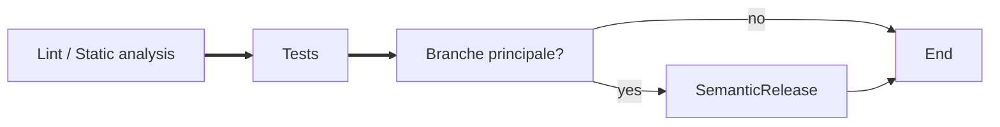

J'ai l'habitude de générer plein de projets applicatifs. L'inconvénient est que
je me retrouve à toujours répéter les mêmes manipulations pour obtenir un
squelette fonctionnel. C'est encore plus vrai dans un écosystème air-gap
entreprise. Ce guide vous montre comment `copier` permet de construire un
archétype (*template*) puis de le réutiliser et le maintenir sans repartir de
zéro.

Ce que vous allez apprendre :

- quand choisir `copier` plutôt qu'un autre scaffolder;
- comment générer un projet à partir d'un template simple;
- comment définir des variables et des règles de rendu;
- comment appliquer une mise à jour sur un projet déjà généré.

## Démarrer en 10 minutes

Voici la séquence la plus courte pour tester `copier` sur un exemple réel :

1. Installez l'outil :

   ```bash
   pip install copier
   ```

2. Générez un projet à partir du template de référence fourni dans ce workspace :

   ```bash
   copier copy ../copier-uv-python-project ./mon-projet
   ```

3. Répondez aux questions posées par `copier` et ouvrez le projet généré.
4. Appliquez ensuite une mise à jour avec :

   ```bash
   copier update ./mon-projet
   ```

Cette boucle simple permet de comprendre rapidement la logique de base avant de
construire un template plus élaboré.

## Qu'est-ce que copier ?


[`copier` est un outil de scaffolding](https://copier.readthedocs.io/en/stable/) (génération de projet) léger et moderne basé sur des templates Jinja2. Il permet de générer rapidement un projet à partir d'un modèle (*template*) et d'appliquer ensuite les évolutions du template sur les projets existants. De prime abord, l'outil présente quelques caractéristiques notables :

- **Simplicité** : les templates sont des fichiers texte utilisant Jinja2, faciles à lire et à éditer.
- **Mise à jour** : workflow d'`update` intégré pour propager les changements du template.
- **Flexible** : supporte les templates locaux et les dépôts Git.

### Comparaison de l'écosystème des scaffolders

Pour comprendre l'intérêt de `copier`, je vous résume ci-dessous les outils de scaffolding
les plus courants, pour vous aider à choisir selon vos besoins.

| Outil | Moteur / format | Mises à jour | Écosystème | Idéal pour |
|---|---|---:|---|---|
| **Copier** | Jinja2 | Oui — workflow d'update intégré | Croissant (templates Python & génériques) | Projets maintenables où appliquer des évolutions de template |
| **Cookiecutter** | Jinja2 | Non (génération one‑shot) | Très large (templates Python) | Génération rapide de projets et nombreux templates existants |
| **Yeoman** | EJS / générateurs Node.js | Variable, selon le générateur | Large (JS/Frontend) | Scaffolding d'apps web / écosystème JavaScript |
| **degit / git clone** | — (copie brute) | Non | N/A | Copier un starter sans templating ni questions |


- __Historique des Stars de `Cookiecutter`, `Copier`, `Yeoman`__

    ---
	[](https://www.star-history.com/?repos=copier-org%2Fcopier%2Ccookiecutter%2Fcookiecutter%2Cyeoman%2Fyeoman&type=date&legend=top-left)

On peut résumé le choix du bon outil pour votre quotidien avec les arguments suivants :

- Choisissez **Copier** si vous souhaitez pouvoir propager des corrections et améliorations du template vers les projets déjà créés.
- Choisissez **Cookiecutter** pour une simplicité maximale et une vaste bibliothèque de templates prêts à l'emploi.
- Choisissez **Yeoman** pour des generators complexes dans l'écosystème JavaScript.

Étant donné l'intérêt pour la maintenance des projets et la capacité à appliquer des mises à jour, mon attention se porte naturellement sur `copier`.

## Utiliser Copier

### Prérequis

Installez `copier` dans votre environnement Python :

```bash
pip install copier
```
### Génération d'un exemple rapide

Générer un projet à partir d'un template local :

```bash
copier copy /chemin/vers/mon-template ./nouveau-projet
```

Générer un projet à partir d'un template distant (ex. dépôt Git) :

```bash
copier copy https://github.com/DiamondLightSource/python-copier-template.git ./nouveau-projet
```

Lancez `copier --help` ou `copier copy --help` pour voir les options disponibles.

Le fichier `copier.yml` du dépôt correspond aux questions interactives
que vous répondez.
Le fichier contient des variables et des propriétés de configuration.

## Créer son premier template de scaffolding

Maintenant on va essayer de créer son propre template pour personnaliser notre
expérience et identifier les capacités de `copier`.

### Structure d'un template

!!! Remarque sur les extensions
	Les fichiers de template sont interprété par l'extension `.jinja`. Cependant,
	vous pouvez utiliser n'importe quelle extension comme `.j2` en surchargeant
	le suffixe des templates Jinja2 utilisé. Il faudra définir :
	`_templates_suffix: .j2`. Copier applique le rendu Jinja2
	au contenu des fichiers et peut aussi utiliser des expressions Jinja dans
	les noms de fichiers.

Un template `copier` est simplement un dossier contenant des fichiers et,
optionnellement, un fichier de configuration (`copier.yml`) qui décrit les
variables demandées par des questions  à l'utilisateur et d'autres métadonnées.

Exemple d'une structure :

```
my-template/
├── copier.yml         # (optionnel) description des variables et valeurs par défaut
├── README.md
└── {{ project_slug }}/
	├── src/
	│   └── main.py
	├── tests/
	├── .gitignore
	├── README.md.jinja # peut contenir {{ project_name }} (Jinja2)
	└── .pre-commit-config.yaml
```

Les fichiers du template peuvent contenir des expressions Jinja2
(ex. `{{ project_name }}`). Il est aussi possible de rendre conditionnels
certains fichiers[^8] ou de nommer des fichiers avec des expressions Jinja.
Dans cet exemple, l'existence du fichier `.pre-commit-config.yaml` est
conditionnée par le booléen `use_precommit` que l'on déclarera dans `copier.yml`.

[^8]: [Conditionner les fichiers](https://copier.readthedocs.io/en/stable/configuring/#conditional-files-and-directories)

### Définir des variables

Le template peut déclarer un fichier YAML (par exemple `copier.yml`) pour fournir des valeurs par défaut et des aides pour les questions posées pendant la génération. Exemple :

```yaml {linenums="1 1 2"}
# copier.yml (exemple)
project_name:
  default: "Mon Projet"
  type: str
  help: "Nom affiché du projet"
project_slug:
  default: mon-projet
  type: str
  help: "Nom du dossier / slug utilisé pour le package"
use_precommit:
	default: true
	type: bool
	help: "Voulez-vous pre-commit?"
```

Pendant la génération, `copier` vous posera ces questions et utilisera les réponses pour rendre les fichiers du template précédent.

### Variables avancées

Explorons les options avancées des variables pour simplifier et durcir notre
template copier.
Dans l'exemple ci-dessous, on rajoute des variables calculées, une question
à choix et des validations.

```yaml {linenums="1 1 2"}
# copier.yml (exemple)
project_name:
  default: MonProjet
  type: str
  help: "Nom affiché du projet"

project_slug:
  default: mon-projet
  type: str
  default: ""
  validator: >-
    
    project_slug est requis.
    
    project_slug doit contenir uniquement des lettres (A-Z, a-z), des chiffres 1-9 et des tirets.
    
  when: false # Pas de question, valeur calculée à partir de project_name

python_version:
  type: str
  help: What Python version do you want to use?
  default:
  choices:
    - "3.11"
	- "3.12"
	- "3.13"
	- "3.14"
# Pas de question mais possible de surcharger. Defaut: prend année du jour.
copyright_year:
  type: str
  default: "{{ copyright_year | default('%Y' | strftime) }}"
  when: false
```

!!! tips "Aller plus loin"
	il est possible de faire du multi-choix, des choix dynamiques[^9],
	d'inclure des questions depuis un autre fichier[^10]. Certaines
	expressions jinja typiquement dans des noms de fichier peuvent
	devenir imbuvables ou répétés à plusieurs endroits. Pour simplifier,
	vous pouvez inclure des expressions.[^11]

[^9]: [questions avec des choix avancées](https://copier.readthedocs.io/en/stable/configuring/#advanced-prompt-formatting)
[^10]: [inclusion de questions depuis d'autres yaml](https://copier.readthedocs.io/en/stable/configuring/#include-other-yaml-files)
[^11]: [importer des expressions jinjas](https://copier.readthedocs.io/en/stable/configuring/#importing-jinja-templates-and-macros)

## Mise à jour d'un projet généré

Une des forces de `copier` est la capacité à appliquer des changements faits
au template sur un projet déjà généré (workflow d'`update`)[^21].

[^21]: [workflow copier update](https://copier.readthedocs.io/en/stable/updating/#how-the-update-works)

Commandes de base :

```bash
# Générer (une première fois)
copier copy  https://github.com/Silicoman/copier-uv-python-project.git ./mon-projet

# Appliquer les mises à jour du template sur le projet existant
copier update ./mon-projet
```

Lorsque vous appliquez l'`update`, il est probable qu'il y ait des
conflits sur les fichiers.
La résolution des diffs peut se faire soit en mode inline, comme une résolution
de merge, soit par comparaison des fichiers `.rej` générés.

Flux d'exemple pour une mise à jour :

1. Modifier et committer des changements dans le template (par ex. corriger un fichier de configuration, ajouter une nouvelle option).
2. Dans le projet généré, exécuter `copier update ./mon-projet`.
3. Copier affichera un aperçu des changements et proposera d'accepter/ignorer/éditer les modifications. Résolvez les conflits si nécessaire et commit.

Pour l'automatisation, il est possible de réutiliser le fichier d'answers. Vous
pouvez vous appuyer sur la capacité de migration[^20] avec des commandes à
réaliser en `before` ou en `after` de l'update pour gérer finement des étapes
de migration simples.
[^20]: [option configuration migration](https://copier.readthedocs.io/en/stable/configuring/#migrations)

## Créer un template complexe évolutif

Jusqu'à présent, on a survolé les fonctionnalités. Mettons en pratique la
construction d'un template `copier` générant le squelette d'un projet python
`uv`. La structure ci-dessous présente un dépôt git.
Le template est contenu dans un sous répertoire. Les fichiers à la racine
servent à la configuration du template et des tests de vérification.

Parmi les éléments du template qui seront déployés dans le nouveau projet,
on trouvera le fichier des réponses. L'enregistrement de la version
du template utilisé et des paramètres du template permet d'affiner les
migrations à faire.

```
uv-copier-template/
├── copier.yml
├── .gitignore
├── README.md
├── includes/
│	└── name-slug.jinja
├── template/
	│	docs/
	│	└── index.md.jinja
	└── src/
		├── ""/
		│  	└── __main__.py.jinja
		├── tests/
		├── .gitignore
		├── README.md.jinja
		├── .pre-commit-config.yaml
		├── {{_copier_conf.answers_file}}.jinja
		└── .gitlabci.yml
├── tests/
│	├── test_scaffold.py
└── .gitlabci.yml
```

Voici quelques éléments exemple de la gestion jinja entre `copier.yml`,
des variables dynamiques et un fichier jinja contenant des variables.

=== "copier.yml"
    ```yaml {linenums="1 1 2"}
	_min_copier_version: "9.15.1"
	_subdirectory: template
	_exclude:
	    - includes
	_message_after_copy: |
	    Your package "{{ project_name }}" has been created successfully.
	_message_after_update: |
	    Your project "{{ project_name }}" has been updated successfully!
	    In case there are any conflicts, please resolve them. Then,
	    you're done.
	project_name:
	    type: str
	    help: What is the package name?
	    validator: >-
	        
	        Name is required.
	        
	        Only alphanumeric characters and single spaces are allowed.
	        

	description:
	    type: str
	    help: What does the package do?
	    placeholder: "..."
	python_version:
	    type: str
	    help: What Python version do you want to use?
	    default: "3.13.6"
	    validator: >-
	        
	        python_version is required.
	        
	        python_version must be in the form X.Y.Z (e.g. 3.13.6).
	        
	    when: true
	copyright_year:
		type: str
		default: "{{ copyright_year | default('%Y' | strftime) }}"
		when: false
	```

=== "pyproject.toml.jinja"
	```toml {linenums="1 1 2"}
	[project]
	name = ""
	version = "0.0.0"
	description = "{{ description }}"
	authors = []
	readme = "README.md"
	requires-python = ">={{ python_version }},<4.0"
	dependencies = [
	]

	[project.urls]
	homepage = "{{ repository_url }}"
	source = "{{ repository_url }}"

	[build-system]
	requires = ["uv_build>=0.10.7,<0.11.0"]
	build-backend = "uv_build"

	[dependency-groups]
	dev = [
	    "coverage[toml] (>=7.13.4,<8.0.0)",
	    "pre-commit (>=4.5.1)",
	    "pytest (>=8.4.2)",
	    "ruff (>=0.15.4)"
	]

	[tool.coverage.report]  # https://coverage.readthedocs.io/en/latest/config.html#report
	fail_under = 0
	precision = 1
	show_missing = true
	skip_covered = true

	[tool.coverage.run]  # https://coverage.readthedocs.io/en/latest/config.html#run
	branch = true
	command_line = "--module pytest"
	data_file = "reports/.coverage"
	source = ["src"]

	[tool.coverage.xml]  # https://coverage.readthedocs.io/en/latest/config.html#xml
	output = "reports/coverage.xml"

	[tool.pytest.ini_options]  # https://docs.pytest.org/en/latest/reference/reference.html#ini-options-ref
	addopts = "-exitfirst --failed-first --strict-config --strict-markers"
	testpaths = ["src", "tests"]
	xfail_strict = true
	log_file_level = "info"
	pythonpath = "src"

	[tool.ruff]
	fix = true
	line-length = 120
	src = ["src", "tests"]
	target-version = "py312"
	preview = true

	[tool.ruff.lint.flake8-tidy-imports]
	# Disallow all relative imports.
	ban-relative-imports = "all"
	```

=== "includes/name-slug.jinja"
	```jinja
	{{ project_name | lower | replace(' ', '-') }}
	```

=== "{{_copier_conf.answers_file}}.jinja"
	```jinja
	# Changes here will be overwritten by Copier; NEVER EDIT MANUALLY
	{{ _copier_answers | to_nice_yaml -}}
	```

!!! warning "expressions jinja"
	Un fichier include ne doit contenir aucun retour à la ligne au risque
	d'en diffuser dans les variables.

### L'intégration continue au service de `copier`

Si vous devez maintenir des templates, vous allez probablement les faire
évoluer, modifier certains comportements. Dans un premier temps,
vous devrez rajouter le versionnement avec du `semantic release`.
L'ajout de tests d'assertions n'est pas un luxe afin de prévenir des
régressions et de tester des scénarios d'upgrade.



=== "tests/test_scaffold.py"
	```py {linenums="1 1 2"}

	import subprocess
	import sys
	from pathlib import Path
	import ast
	import pytest


	def _run_copier(template_path: Path,
					dest: Path,
					project_name: str = "testproj") -> None:
	    cmd = [
	        "copier",
	        "copy",
	        str(template_path),
	        str(dest),
	        "-f",
	        "-d",
	        f"project_name={project_name}",
	        "-d",
	        "python_version=3.13.6",
	        "-d",
	        "description=testing",
	    ]
	    # Use check=True so failures raise and fail the test.
	    subprocess.run(cmd, check=True,
						stdout=subprocess.PIPE,
						stderr=subprocess.STDOUT,
						text=True, timeout=120)


	def test_copier_creates_expected_files(tmp_path: Path):
	    """Run copier against the local template and assert basic files are rendered."""
	    template_root = Path(__file__).resolve().parent.parent
	    dest = tmp_path / "out"
	    _run_copier(template_root, dest, project_name="testproj")

	    # Basic files
	    assert (dest / "pyproject.toml").exists(), "pyproject.toml should be created"
	    assert (dest / "README.md").exists(), "README.md should be created"
	```

Dans ce test, on réalise un simple contrôle de l'existence des fichiers.
Vous pouvez aller plus loin en comparant le contenu des fichiers et en testant
des scénarios de migration intermédiaire.

!!! tips "appeler l'api copier en python"
	```py
	from copier import run_copy

	# Create a project from a local path
	run_copy("path/to/project/template", "path/to/destination")
	```

### Copier Update en pratique

!!! warning "Recommandation prérequis git-ifier"
	Pour utiliser l'`update` efficacement, votre template doit être versionner.
	Tout les fichiers de votre dépôt cible doit être commit.

Considérons le scénario où le template a eu une mise à jour d'une des
propriétés de `pyproject.toml`.
Dans ce cas, le `tool.ruff.target-version` passe de `py312` à `py313`.

=== "pyproject.toml.jinja v1"
	```toml {linenums="1 1 2"}
	[project]
	name = ""
	version = "0.0.0"
	description = "{{ description }}"
	authors = []
	readme = "README.md"
	requires-python = ">={{ python_version }},<4.0"
	dependencies = [
	]

	[project.urls]
	homepage = "{{ repository_url }}"
	source = "{{ repository_url }}"

	[build-system]
	requires = ["uv_build>=0.10.7,<0.11.0"]
	build-backend = "uv_build"

	[dependency-groups]
	dev = [
	    "coverage[toml] (>=7.13.4,<8.0.0)",
	    "pre-commit (>=4.5.1)",
	    "pytest (>=8.4.2)",
	    "ruff (>=0.15.4)"
	]

	[tool.coverage.report]
	fail_under = 0
	precision = 1
	show_missing = true
	skip_covered = true

	[tool.coverage.run]
	branch = true
	command_line = "--module pytest"
	data_file = "reports/.coverage"
	source = ["src"]

	[tool.coverage.xml]
	output = "reports/coverage.xml"

	[tool.pytest.ini_options]
	addopts = "-exitfirst --failed-first --strict-config --strict-markers"
	testpaths = ["src", "tests"]
	xfail_strict = true
	log_file_level = "info"
	pythonpath = "src"

	[tool.ruff]
	fix = true
	line-length = 120
	src = ["src", "tests"]
	target-version = "py312"
	preview = true

	[tool.ruff.lint.flake8-tidy-imports]
	# Disallow all relative imports.
	ban-relative-imports = "all"
	```
=== "pyproject.toml.jinja v2"
	```toml {linenums="1 1 2"}
	[project]
	name = ""
	version = "0.0.0"
	description = "{{ description }}"
	authors = []
	readme = "README.md"
	requires-python = ">={{ python_version }},<4.0"
	dependencies = [
	]

	[project.urls]
	homepage = "{{ repository_url }}"
	source = "{{ repository_url }}"

	[build-system]
	requires = ["uv_build>=0.10.7,<0.11.0"]
	build-backend = "uv_build"

	[dependency-groups]
	dev = [
	    "coverage[toml] (>=7.13.4,<8.0.0)",
	    "pre-commit (>=4.5.1)",
	    "pytest (>=8.4.2)",
	    "ruff (>=0.15.4)"
	]

	[tool.coverage.report]
	fail_under = 0
	precision = 1
	show_missing = true
	skip_covered = true

	[tool.coverage.run]
	branch = true
	command_line = "--module pytest"
	data_file = "reports/.coverage"
	source = ["src"]

	[tool.coverage.xml]
	output = "reports/coverage.xml"

	[tool.pytest.ini_options]
	addopts = "-exitfirst --failed-first --strict-config --strict-markers"
	testpaths = ["src", "tests"]
	xfail_strict = true
	log_file_level = "info"
	pythonpath = "src"

	[tool.ruff]
	fix = true
	line-length = 120
	src = ["src", "tests"]
	target-version = "py313"
	preview = true

	[tool.ruff.lint.flake8-tidy-imports]
	# Disallow all relative imports.
	ban-relative-imports = "all"
	```

En parallèle, notre projet a évolué en ajoutant des dépendances et en
montant de version. Nous allons maintenant appliquer les mises à jour du
template et modifier un des paramètres de génération.

```sh
	copier update mydemo --skip-answered --data python_version="3.14.3"
```

=== "pyproject.toml v1"
	```toml hl_lines="2 3"

	[project]
	name = "mydemo"
	version = "1.0.0"
	description = "my super demo"
	authors = []
	readme = "README.md"
	requires-python = ">=3.13.6,<4.0"
	dependencies = [
	    "requests>=2.34.2",
	]

	[project.urls]


	[build-system]
	requires = ["uv_build>=0.10.7,<0.11.0"]
	build-backend = "uv_build"

	[dependency-groups]
	dev = [
	    "coverage[toml] (>=7.13.4,<8.0.0)",
	    "pre-commit (>=4.5.1)",
	    "pytest (>=8.4.2)",
	    "ruff (>=0.15.4)"
	]

	[tool.coverage.report]
	fail_under = 0
	precision = 1
	show_missing = true
	skip_covered = true

	[tool.coverage.run]
	branch = true
	command_line = "--module pytest"
	data_file = "reports/.coverage"
	source = ["src"]

	[tool.coverage.xml]
	output = "reports/coverage.xml"

	[tool.pytest.ini_options]
	addopts = "-exitfirst --failed-first --strict-config --strict-markers"
	testpaths = ["src", "tests"]
	xfail_strict = true
	log_file_level = "info"
	pythonpath = "src"

	[tool.ruff]
	fix = true
	line-length = 120
	src = ["src", "tests"]
	target-version = "py312"
	preview = true

	[tool.ruff.lint.flake8-tidy-imports]
	# Disallow all relative imports.
	ban-relative-imports = "all"
	```

=== "pyproject.toml v2"
	```toml {linenums="1 1 2"}
	[project]
	name = "totu"
	version = "1.0.0"
	description = "my super tuatoat"
	authors = []
	readme = "README.md"
	requires-python = ">=3.14.3,<4.0"
	dependencies = [
	    "requests>=2.34.2",
	]

	[project.urls]


	[build-system]
	requires = ["uv_build>=0.10.7,<0.11.0"]
	build-backend = "uv_build"

	[dependency-groups]
	dev = [
	    "coverage[toml] (>=7.13.4,<8.0.0)",
	    "pre-commit (>=4.5.1)",
	    "pytest (>=8.4.2)",
	    "ruff (>=0.15.4)"
	]

	[tool.coverage.report]
	fail_under = 0
	precision = 1
	show_missing = true
	skip_covered = true

	[tool.coverage.run]
	branch = true
	command_line = "--module pytest"
	data_file = "reports/.coverage"
	source = ["src"]

	[tool.coverage.xml]
	output = "reports/coverage.xml"

	[tool.pytest.ini_options]
	addopts = "-exitfirst --failed-first --strict-config --strict-markers"
	testpaths = ["src", "tests"]
	xfail_strict = true
	log_file_level = "info"
	pythonpath = "src"

	[tool.ruff]
	fix = true
	line-length = 120
	src = ["src", "tests"]
	target-version = "py313"
	preview = true

	[tool.ruff.lint.flake8-tidy-imports]
	# Disallow all relative imports.
	ban-relative-imports = "all"
	```

Les modifications du projet n'ont plus qu'à être commit.
L'ensemble des modifications venant du template, que ce soit le squelette ou les
questions, a été intégré sans conflit.

## Pièges fréquents

- Ne pas oublier de versionner le template avant d'utiliser `copier update`.
- Éviter de modifier manuellement les fichiers générés si vous voulez garder la
  possibilité de fusionner les mises à jour.
- Vérifier les variables de `copier.yml` lorsque vous ajoutez une option de
  génération : une variable mal nommée peut casser un rendu.
- Préparer un scénario de migration simple si vous devez faire évoluer un
  template déjà utilisé en production.

## Conclusion

!!! tip "Créer un catalogue `copier`"
	Pour simplifier l'évolutibilité, chaque template doit rester simple.
	Si vous multipliez les projets `copier` à maintenir, il peut être judicieux
	de faire un template `copier` des projets templates pour harmoniser
	les answers, les expressions jinja utilisées.

`copier` est relativement récent par rapport à ces alternatives. Il existe
[quelques bugs principalement sur la partie `update`](https://github.com/copier-org/copier/issues). C'est la fonctionnalité phare de `copier` mais qui est la
plus difficile à implémenter. Cela nécessite un contrat de qui fait quoi
entre le projet généré et le template pour éviter au maximum des conflits.
Si vous automatisez les `update`, il faudra
bien réfléchir comment résoudre les conflits. Une solution simple serait
d'ouvrir une pull request avec les fichiers en conflit pour faire valider
dans vos chaines CI/CD les changements.

Quelques remarques pour bien démarrer :

- Gardez les templates petits et ciblés (un template = un type de projet).
- Documentez les variables dans `copier.yml` pour faciliter l'adoption.
- Testez la génération dans un répertoire temporaire avant de l'utiliser en production.
- Versionnez vos templates (git tags) pour contrôler les mises à jour sur les projets existants.
- Fournissez un fichier d'exemples `answers` pour les utilisateurs qui veulent automatiser la génération.

!!! tips "Appliquer des `update` à l'échelle"
	Lorsque vous aurez multiplié les projets se basant sur votre `copier`,
	vous pourrez combiner `multi-gitter`[^40] avec `copier` pour ouvrir massivement
	des pull requests. Votre flux de travail automatique pourra être le suivant :
	``` mermaid
	graph LR
		Evol["nouvelle version\ntemplate copier\npubliée"]
		Evol -- "parcourir\npar multi-gitter\n les dépôts" --> MR["création\n des PR"]
		MR --> COPIER["Appliquer\ncopier update\n + commit"]
		COPIER --> CICD["Jobs CI\n validation aucune régression"]
		CICD -- success --> END["Merge"]
	```

[^40]: [multi-gitter](https://github.com/lindell/multi-gitter) automatise la création des pull/merge requests, applique un script sur chaque dépôt et commit. Il peut finaliser le travail en mergeant automatiquement.

Pour ceux qui travaillent de près ou de loin sur les `internal developer platform`,
il existe le projet [scaffolder-backend-module-copier](https://github.com/telia-oss/scaffolder-backend-module-copier) pour l'intégration avec `backstage`. Le projet n'est plus
maintenu mais ça mérite d'y jeter un oeil si vous voulez une source d'inspiration.


## Références

- [Documentation officielle de `copier`](https://copier.readthedocs.io/en/stable/)
- [Exemple d'une source d'inspiration d'un template copier `uv`](https://github.com/lukin0110/uv-copier/tree/main)

- Exemple local de template utilisé dans ce workspace : [copier-uv-python-project](copier-uv-python-project)

---
